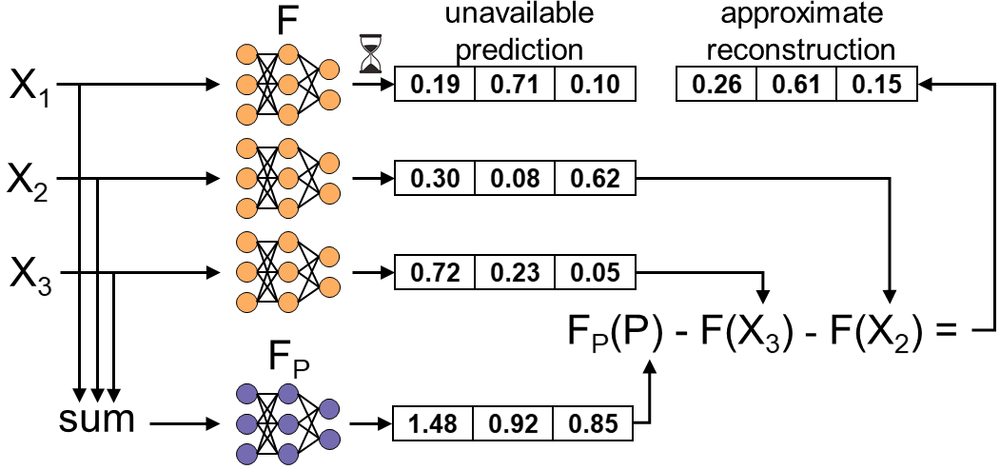

# Learning-Based Coded Computation



Docker env is important.
Coded computation is an emerging approach that applies ideas from coding
theory to impart resource-efficient resilience against slowdowns and failures
that occur in large-scale distributed computing systems. This repository
contains a framework for exploring the use of machine learning to apply
coded computation to broader classes of computations. More background
on coded computation, its challenges, and the potential for machine learning
within coded computation is provided in [this blog post](https://deepcomm.github.io/jekyll/pixyll/2020/06/22/learned-coded-computation-part1/).

This repository focuses primarily on applying learning-based coded computation to
impart resilience to distributed systems performing inference with neural
networks.

This repository contains the code used for the following papers:
* [Learning-Based Coded Computation](https://ieeexplore.ieee.org/document/9047948). Jack Kosaian, K. V. Rashmi, and Shivaram Venkataraman. In IEEE Journal on Selected Areas in Information Theory, 2020

* [Parity Models: Erasure-Coded Resilience for Prediction Serving Systems](https://dl.acm.org/doi/10.1145/3341301.3359654). Jack Kosaian, K. V. Rashmi, and Shivaram Venkataraman. In Proceedings of the 27th ACM Symposium on Operating Systems Principles (SOSP), 2019

* [Learning a Code: Machine Learning for Approximate Non-Linear Coded Computation](https://arxiv.org/abs/1806.01259). Jack Kosaian, K. V. Rashmi, and Shivaram Venkataraman. arXiv preprint arXiv:1806.01259, 2018

This repository originated as the artifact associated with the SOSP 2019 paper
[Parity Models: Erasure-Coded Resilience for Prediction Serving Systems](https://dl.acm.org/doi/10.1145/3341301.3359654).
It has since evolved beyond serving this paper in isolation. The original
artifact associated with the SOSP 2019 paper is located in the
[sosp2019-artifact branch](https://github.com/Thesys-lab/parity-models/tree/sosp2019-artifact).

## Repository structure
* [train](train): Code for training a neural network parity model
* [clipper-parm](clipper-parm): Code for ParM, a prediction serving system that
employs learning-based coded computation to impart resilience against slowdowns
and failures. For more details, see [our paper.](https://dl.acm.org/doi/10.1145/3341301.3359654)

Please see the READMEs in each of these subdirectories for more details.

## Cloning the repository
If you are only interested in the training portion of the repository, you
can clone the repository as:
```bash
git clone https://github.com/Thesys-lab/parity-models.git
```

If you are interested in running ParM, the prediction serving system employing
parity models, you will need to clone required submodules using the
`--recursive` flag:
```bash
git clone --recursive https://github.com/Thesys-lab/parity-models.git
```

## License
```
Copyright 2019, Carnegie Mellon University

Licensed under the Apache License, Version 2.0 (the "License");
you may not use this file except in compliance with the License.
You may obtain a copy of the License at

    http://www.apache.org/licenses/LICENSE-2.0

Unless required by applicable law or agreed to in writing, software
distributed under the License is distributed on an "AS IS" BASIS,
WITHOUT WARRANTIES OR CONDITIONS OF ANY KIND, either express or implied.
See the License for the specific language governing permissions and
limitations under the License.
```


## Support
We graciously acknowledge support from the National Science Foundation 
(NSF) under grant CNS-1850483, an NSF Graduate Research Fellowship 
(DGE-1745016 and DGE-1252522), and Amazon Web Services.

